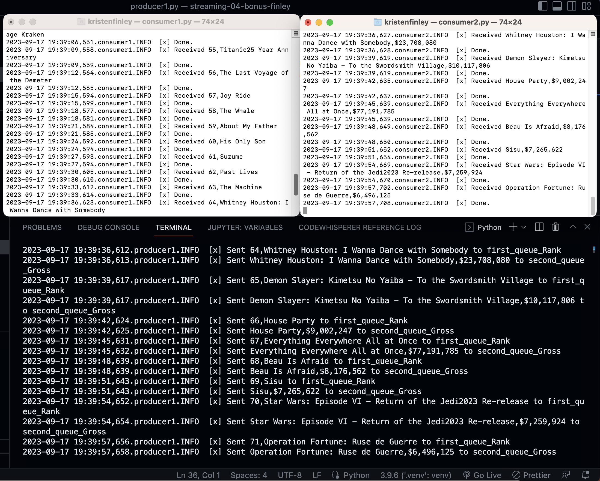

# streaming-04-bonus-finley
Bonus project 4 reads a multi-column CSV file and sends one of the columns to first_queue and one of the columns to second_queue

- Class: STREAMING DATA 44671-80/81FA23
- Assignment: P4-- Optional Bonus
- Name: Kristen Finley
- Date: September 17, 2023

---
## Description:
Use your skills to create a custom project. Earn up to an additional 10%. Practice custom projects - this is the best way to learn. 

This project should read a multi-column CSV file (e.g. data1.csv), and send one of the columns to first_queue and one of the columns to second_queue (use better names) 

- The first worker process will monitor the first queue, and "on getting a message" (that is, in the callback function) perform some analytics or transformation on the value (e.g., change a string to caps, change F to C),  then write a record with the original value, and the transformed result to a new second CSV file, e.g. data2.csv)
- The second worker process will monitor the second queue, and "on getting a message" (that is, in the callback function) perform some analytics or transformation on the value (e.g., change a string to caps, change F to C),  then write a record with the original value, and the transformed result to a new third CSV file (e.g. data3.csv)

## Directions:
1.	Create a new repo named streaming-04-bonus-yourname.
2.	Add a README.md, clone it down to your machine. 
3.	On your machine, add a .gitignore. 
4.	Add your producer (based on version 3 above) and your original csv file. 
5.	Add your consumer1 and consumer2. 
6.	The project should use RabbitMQ and be similar to Version 2 and Version 3 above, but process different data.
7.	Name the files and so they are clear and well-organized in your repo, e.g., start all 3 csv file names with "data", so they appear together. 
8.	Complete the README.md including
    1.	a short description of the project
    2.	your name and date
    3.	instructions on how to run your project
    4.	a screenshot clearly showing your unique streaming process in action. 

## Instructions:
## Setup Task 1. Created Virtual Environment on VS Code and 2 additional Terminals

`python -m venv .venv`

## Setup Task 2. Activated the Virtual Environment

1. In the same VS Code terminal window, activated the virtual environment.

`source .venv/bin/activate`

2. Verified the virtual environment
 - making sure name (.venv) was in terminal prompt, ran 'util_aboutenv.py' 

## Setup Task 3. 
- Copied in requirement.txt file from previous repo.
- Installed Dependencies into the Virtual Environment using Pip

`pip install pika`

## Run .py Files
- Run producer1.py in VS Code Terminal
- Run connsumer1.py in another terminal
- Run connsumer2.py in another terminal
---
## Screenshot:
